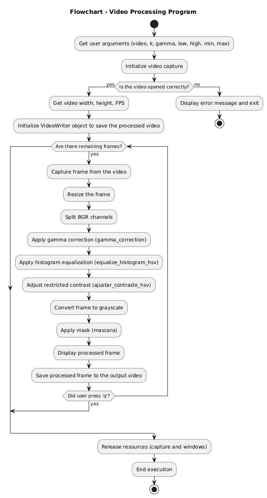
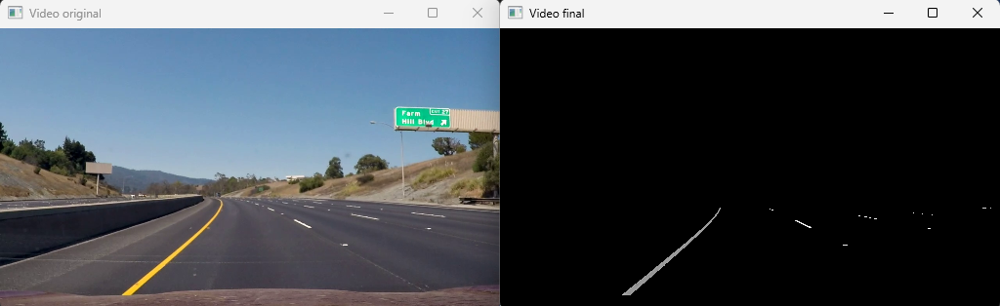

# road-line-tracking
The goal of this project is to design and implement a series of point operators for digital image processing to enhance a video and highlight road lines, aiming to support autonomous driving. This project demonstrates how to precisely track lane lines on a road using Python and its specialized image processing libraries, such as OpenCV, while avoiding the use of high-level operators already implemented in these libraries.

Throughout the development, we will explore how these tools enable us to detect and track lines, which is a critical aspect of advanced driver-assistance systems (ADAS) and autonomous vehicle technologies.

To achieve this, various image processing techniques will be applied, such as:

- Color space transformations
- Brightness and contrast adjustments
- Basic histogram operations

These strategies improve the visibility of lane lines, even under challenging conditions such as changes in lighting, road color, or varying asphalt textures.

**Flowchart**

<p align="center">
  
</p>

---

## Usage Instructions

1. **Environment Setup:**
   - This project was developed with Python 3.10.14.
   - Install the required libraries using the following commands:
     ```bash
     pip install opencv-python numpy matplotlib argparse
     ```

2. **Program Execution:**
   - Run the program from the terminal with the following syntax:
     ```bash
     python .\main.py -v .\lineas.mp4 -o salida.mp4 -k 256 -g 3 -b 0.95 -a 0.95 -m 0 -n 255
     ```

   - **Parameters:**
     - `-v`, `--video`: (Required) Path to the input video file (e.g., `lineas.mp4`).
     - `-o`, `--output`: (Optional) Path to save the output video file (e.g., `salida.mp4`).
     - `-k`, `--k`: (Required) Value for histogram equalization.
     - `-g`, `--gamma`: (Required) Gamma correction value.
     - `-b`, `--low`: (Required) Percentage value for `a_low` adjustment.
     - `-a`, `--high`: (Required) Percentage value for `a_high` adjustment.
     - `-m`, `--min`: (Required) Minimum pixel intensity (`a_min`) for thresholding.
     - `-n`, `--max`: (Required) Maximum pixel intensity (`a_max`) for thresholding.

3. **Output:**
   - The program will generate a processed video (e.g., `salida.mp4`) with enhanced lane visibility, ready for analysis or further processing.

**Results**


